# UnENVerse

**A self-hosted secrets manager for people who run their own infrastructure: a desktop app, a command-line tool and an optional server that share one encrypted vault.**

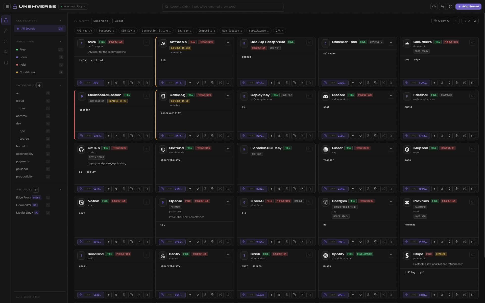

UnENVerse keeps API keys, passwords, certificates, SSH keys, two-factor seeds and whole configuration files (WireGuard, Docker Compose, nginx and more) in a single vault encrypted on your own machine. Nothing is sent to a cloud service, and there is no account to create.

## Overview

Most secrets managers store a password and hand it back. UnENVerse also knows what the secret is _for_. A config file in a project can point at a vault entry (`${GitHub/token}`), so the real value lives in one place and every `wg0.conf`, `docker-compose.yml` or `.env` built from it stays in step when you rotate a key.

It is built around three ideas:

- **The vault is yours.** A SQLCipher database encrypted with a key derived from your master password (Argon2id). The key never touches disk, and there is no recovery service, because there is no server of ours.
- **Scripts and AI agents can use it without seeing your secrets.** The `unv` command redacts every stored value by default and offers ways to _use_ a secret (run a program with it, render a file with it) without ever printing it.
- **It scales from one laptop to a small team.** Run the desktop app alone, or put `unv-server` on a machine you control and give each person their own login, API tokens and permissions.

### What it does

| Area                          | What you get                                                                                                                                                                                                                                                                                    |
| ----------------------------- | ----------------------------------------------------------------------------------------------------------------------------------------------------------------------------------------------------------------------------------------------------------------------------------------------- |
| **Secrets**                   | 26 secret types: API keys, passwords, certificates, SSH and GPG keys, database connections, OAuth clients, web sessions, recovery codes, crypto wallets, licence keys, Wi-Fi networks and more. Tags, categories, environments, expiry dates, rotation reminders and per-entry version history. |
| **Two-factor codes**          | Stores authenticator seeds (TOTP, HOTP, Steam Guard) and shows live codes. Imports from Aegis, 2FAS, andOTP, Ente, Bitwarden and Google Authenticator.                                                                                                                                          |
| **Projects and config files** | Eleven project types: WireGuard, Docker Compose, nginx, Kubernetes, Traefik, Apache, HAProxy, Ansible, Postgres, SSH config and generic `.env`. Build a config from parts, point fields at vault entries, and export the finished file.                                                         |
| **Safety checks**             | A health scan for weak, expiring, duplicated or leaked secrets, and a config checker that finds mistakes across files (an nginx `proxy_pass` to a service that does not exist, two WireGuard peers claiming one address).                                                                       |
| **Command line**              | `unv` covers everything the app does. Values are redacted by default, output is JSON with stable exit codes, and `unv exec` and `unv render` use a secret without printing it.                                                                                                                  |
| **Server and sharing**        | An optional HTTP/HTTPS server with certificate pinning, per-row merge of simultaneous edits, `/api/health`, calendar feeds for expiry dates and a registry of issued IDs.                                                                                                                       |
| **Multi-user access**         | Named users, classes (role templates), API tokens, optional two-factor login and a permission language such as `project:web AND NOT env:production`.                                                                                                                                            |
| **Nodes**                     | Agents on your other machines watch a config file, report when it drifts from the vault and, if you allow it, receive the new version. Pushes can require your approval.                                                                                                                        |
| **History and audit**         | A tamper-evident audit log, a snapshot of every rendered config with secrets masked, and a "blast radius" report that lists exactly which credentials a machine has seen.                                                                                                                       |
| **Import and export**         | `.env`, Bitwarden, 1Password, Proton Pass, FIDO Credential Exchange, browser captures (cURL, HAR, cookies) and encrypted backups.                                                                                                                                                               |

### Who it is for

- Developers and homelab owners who keep tokens, certificates and config files scattered across notes and `.env` files.
- Small teams that want a self-hosted vault with real access control but not a platform to operate.
- Anyone who runs scripts or AI coding agents and wants them to _use_ credentials without being able to read them.

### What it is not

- It is not a hosted service. You run it, you back it up.
- It is not a browser autofill extension.
- A forgotten master password cannot be recovered. See [Backups](#backups-and-the-one-thing-you-cannot-recover).

## Tour

**Sign in.** Open the app and create a vault, or connect to a server.

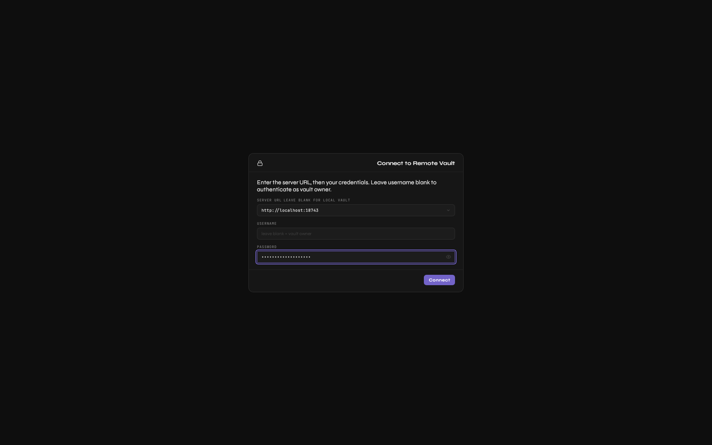

**Add any kind of secret.** The form adapts to the type and shows the environment variable name it will generate.

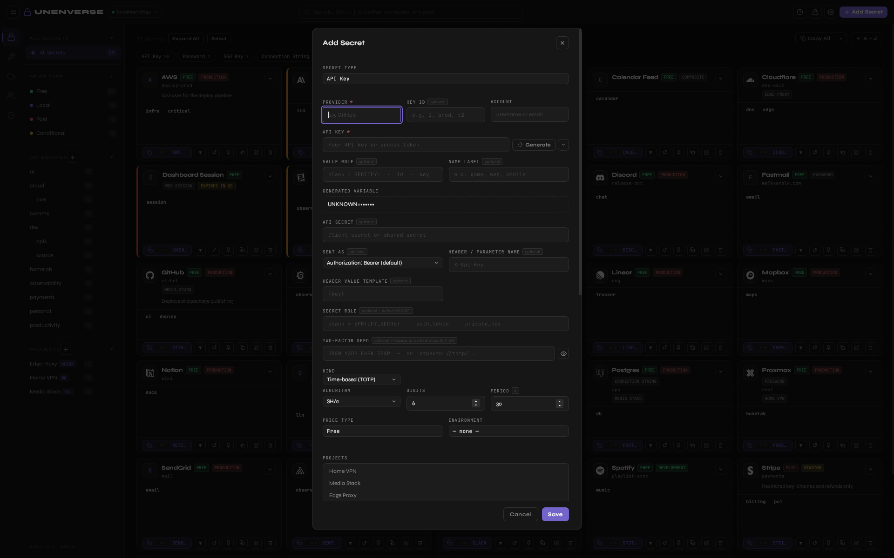

**Keep config files and secrets together.** A project holds the parts of a real config; fields can reference vault entries.

| WireGuard                                               | Docker Compose                                             | nginx                                           |
| ------------------------------------------------------- | ---------------------------------------------------------- | ----------------------------------------------- |
| 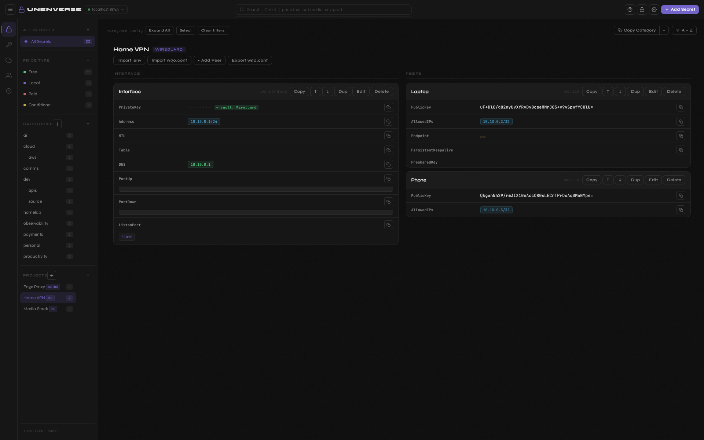 | 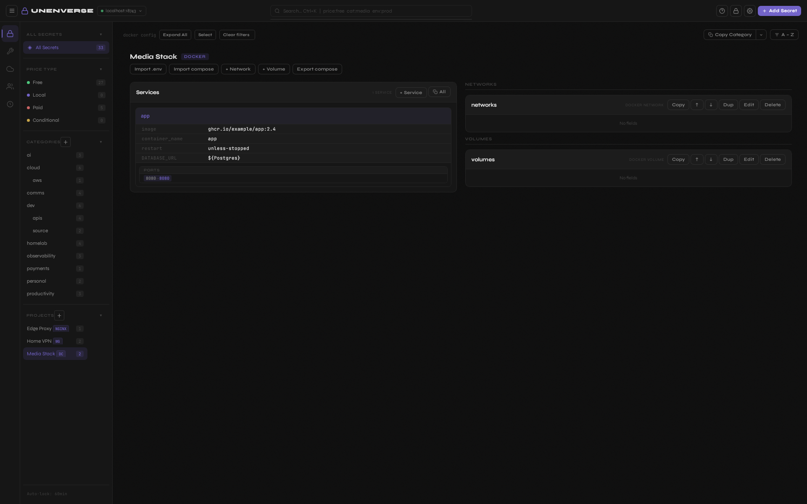 | 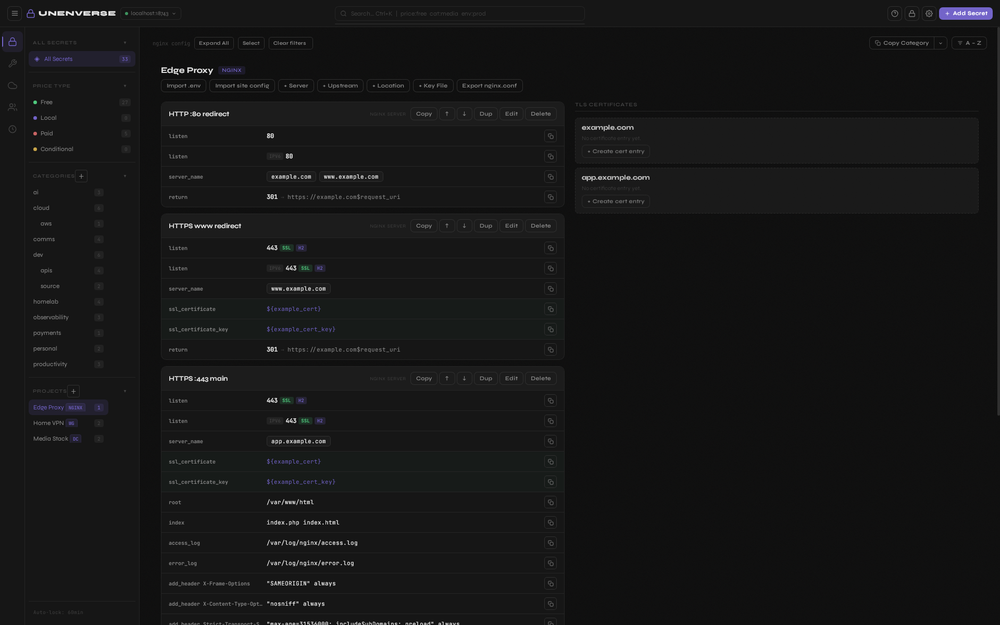 |

**Two-factor codes** sit next to the credentials they protect.

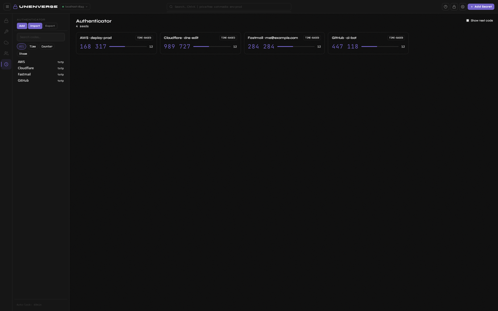

**Find what needs attention.** The health scan lists expiring, stale and risky secrets.

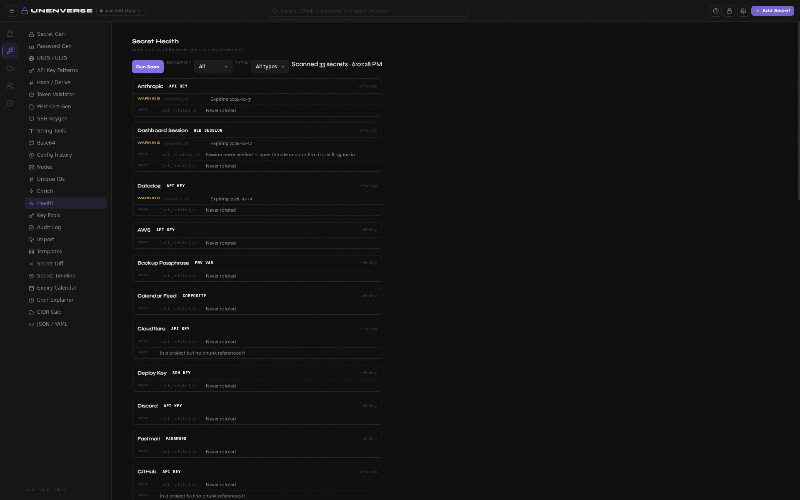

**Share with a team, with limits.** Users, classes and permission expressions decide who sees what.

| Users                                      | A user's permissions                                        | Classes                             |
| ------------------------------------------ | ----------------------------------------------------------- | ----------------------------------- |
| 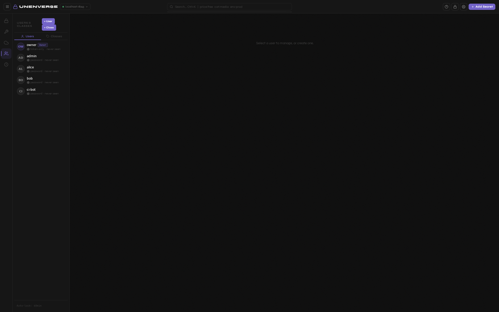 | 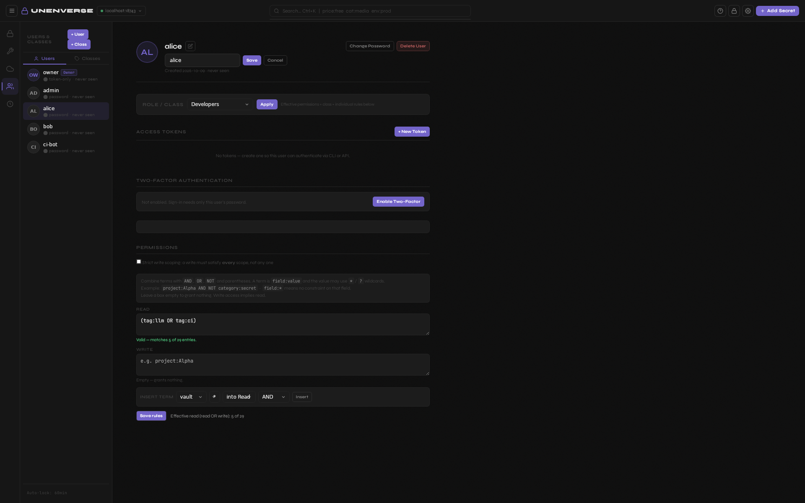 | 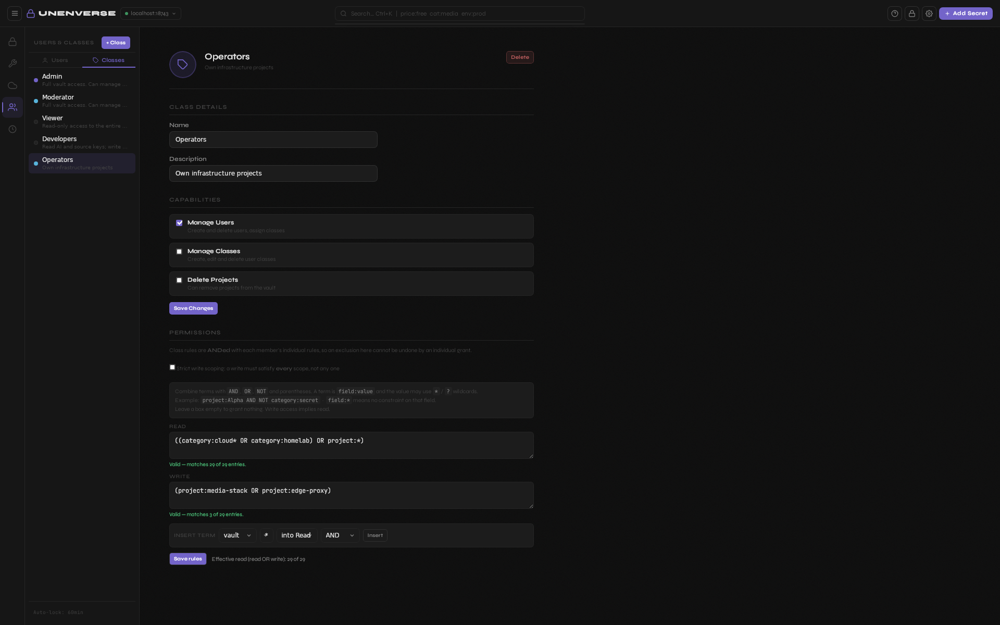 |

The screenshots show a demo vault with invented data. `tools/demo/run.sh` rebuilds them.

## Quick start

1. Download the installer for your system from the [Releases](../../releases) page (see [Install](#install)).
2. Launch UnENVerse and choose a master password of at least twelve characters. **Write it down: it cannot be recovered.**
3. Click **Add Secret**, pick a type, fill it in and save.
4. Optional: install the command line tool and use a secret without printing it:

```bash
unv list                                  # names and types, values redacted
unv get GitHub                            # one entry, still redacted
unv exec -- ./deploy.sh                   # run a program with your secrets in its environment
unv render config.tpl --out config.conf   # fill ${references} in a template
```

## Contents

- [Overview](#overview)
- [Tour](#tour)
- [Quick start](#quick-start)
- [Install](#install)
- [First run](#first-run)
- [The desktop app](#the-desktop-app)
- [Secrets](#secrets)
- [Authenticator codes](#authenticator-codes)
- [Copy profiles and generated names](#copy-profiles-and-generated-names)
- [Web sessions, composites and bundles](#web-sessions-composites-and-bundles)
- [The provider catalogue](#the-provider-catalogue)
- [Projects, chunks and exports](#projects-chunks-and-exports)
- [Tools](#tools)
- [Settings, shortcuts and auto-lock](#settings-shortcuts-and-auto-lock)
- [The CLI](#the-cli)
- [Entropy sources](#entropy-sources)
- [Key pools](#key-pools)
- [Backups, and the one thing you cannot recover](#backups-and-the-one-thing-you-cannot-recover)
- [The server](#the-server)
- [Open to LAN](#open-to-lan)
- [Calendar feeds and the unique-ID registry](#calendar-feeds-and-the-unique-id-registry)
- [Nodes](#nodes)
- [Config history](#config-history)
- [Blast radius](#blast-radius)
- [Stack integrations](#stack-integrations)
- [Concurrent writes](#concurrent-writes)
- [Docker](#docker)
- [Multiple users](#multiple-users)
- [Permission expressions](#permission-expressions)
- [The security model](#the-security-model)
- [Where your files live](#where-your-files-live)
- [Building from source](#building-from-source)
- [Development](#development)
- [Continuous integration](#continuous-integration)
- [License](#license)

## Install

### From a release

Grab the artefact for your platform from the [Releases](../../releases) page.

| File                        | Platform                                                                                                            |
| --------------------------- | ------------------------------------------------------------------------------------------------------------------- |
| `*.AppImage`                | Any Linux distribution. SQLCipher and OpenSSL are compiled in, so it does not care what your package manager ships. |
| `*.deb`                     | Debian, Ubuntu                                                                                                      |
| `*.rpm`                     | Fedora, RHEL, Nobara                                                                                                |
| `*-setup.exe`               | Windows. Fetches WebView2 during install if the machine lacks it.                                                   |
| `unv-*-linux-x86_64.tar.gz` | `unv` and `unv-server`, no GUI toolkit required                                                                     |
| `unv-*-windows-x86_64.zip`  | The same two, for Windows                                                                                           |

Every asset carries a keyless Sigstore signature. If you want to confirm a download actually came out of this repository's CI and not from somewhere else:

```bash
cosign verify-blob \
  --certificate <asset>.pem \
  --signature   <asset>.sig \
  --certificate-identity-regexp 'https://github.com/.*/(UnENVerse|EnvVault)/.*' \
  --certificate-oidc-issuer https://token.actions.githubusercontent.com \
  <asset>
```

`SHA256SUMS` is in the release too, if you only want to confirm the bytes.

### From source

See [Building from source](#building-from-source) at the bottom.

## First run

On first launch the app asks you to create a master password of at least twelve characters.

That password is never stored anywhere. It goes through Argon2id (m=65536, t=3, p=1) with a 16-byte random salt to derive a 32-byte key, and that key opens the SQLCipher database. The key lives in memory and is zeroed when you lock.

If you forget the password, the vault cannot be recovered. There is no reset link and no support channel that can help. The only option is to delete `vault.db` and `vault.salt` and start with an empty vault, so store the password somewhere safe.

**Keep the salt with the database.** A vault is lost most often by separating the two files. `vault.salt` is sixteen bytes of CSPRNG output, written once, derived from nothing, and stored nowhere else. A `vault.db` without it cannot be opened by anyone, including you, and nothing can recompute it. Copying the database to a new machine and leaving the salt behind is a permanent loss that looks like a forgotten password, because every unlock attempt reports "wrong password" for a password that is perfectly correct.

Two things guard against that: `unv backup archive` writes both files into one encrypted archive, and any attempt to open a database whose salt has gone missing refuses outright instead of silently generating a fresh one. `unv doctor` and `unv status` both tell you where the salt is and remind you to keep it with the database.

## The desktop app

### Layout

An activity bar down the left (or the right, if you move it in Settings) switches between Vault, Remote, Users, Tools and Settings. The sidebar next to it filters. The grid holds the cards.

The sidebar filters by category, project, tag, environment and prefix. Categories are flat tags with slash nesting for grouping. Projects are real objects that carry config chunks and a type. Drag the divider to resize the sidebar, double-click it to reset, and press `B` to collapse it entirely. Whatever you leave it as is what you get next launch.

### Adding a secret

`Ctrl+N`, or the button in the header. Pick the type first, because the type decides which fields the form shows. A certificate wants a PEM and its private key. A connection string wants a URL. An API key wants a key and optionally a key id.

Every field that can be generated has a Generate button next to it, and the generator is type-aware. Press it on a password field and you get a password. Press it on a certificate and you get a self-signed certificate with its key.

### What a card can do

Click to expand. The card shows the fields, and the buttons across the top do the rest:

- Copy the secret, with `${refs}` resolved.
- Reveal it, which is off again the next time you open the screen.
- Edit, duplicate, delete (with a five-second undo).
- Pin it to the top of the grid.
- Mark it compromised, which colours it red and puts it at the top of the health scan.
- Rotate it, which stamps `last_rotated_at` and can generate the replacement for you.
- Open its version history and restore an old revision.

### Searching

`Ctrl+K` focuses the search bar. It searches names, usernames, notes, tags and categories. The last eight searches are remembered and offered as a dropdown. `Esc` clears it, `Shift+Esc` clears every active filter at once, which exists because a filter restored from a previous session is one you do not remember setting.

## Secrets

### The types

The original seven:

| Type                | What it holds                                 |
| ------------------- | --------------------------------------------- |
| `api_key`           | A key, optionally a secret and a key id       |
| `password`          | A password with a username or an email        |
| `certificate`       | A PEM certificate and its private key         |
| `env_var`           | A single environment variable, with a subtype |
| `connection_string` | A database or service URL                     |
| `ssh_key`           | An OpenSSH keypair                            |
| `file_blob`         | A path to a file that lives outside the vault |

Nineteen more joined them, all described by one registry file read by both the app and the CLI, so a type is a descriptor rather than a dozen scattered edits:

| Group                 | Types                                                                                                         |
| --------------------- | ------------------------------------------------------------------------------------------------------------- |
| Sessions and shapes   | `cookie` (a web session), `composite` (one value with secrets inside), `bundle` (several entries as one card) |
| Developer and infra   | `oauth_client`, `signing_key`, `registry_token`, `database`, `recovery_codes`, `gpg_key`, `age_key`           |
| Self-hosted and media | `local_service`, `tracker`, `usenet_server`                                                                   |
| Personal              | `wifi`, `license_key`, `crypto_wallet`, `passkey`, `secure_note`, `identity_document`                         |

The type is not decoration. It decides which fields the form offers, how the card renders, what the generator produces, how an exporter treats the value, whether a health check applies and whether `enrich --online` may contact anyone. An entry whose type this build does not know is shown read-only with a banner and cannot be saved over, so opening a newer vault in an older app never downgrades it to an API key.

### Environment-variable subtypes

An `env_var` carries a display hint: string, multiline, secret, boolean, number, ip, cidr, port, url, date or json. It changes how the value is shown and validated. A `port` that is not a number is worth catching before it reaches a config file.

### What every entry carries, regardless of type

Names, usernames, emails, URLs, notes, tags, categories, project membership, environment, an expiry date, a rotation cadence, a price type and a free-text scope list. Beyond those:

- **`purpose`**, which is the justification you gave the issuer when you asked for the credential. Six months later that is the field you actually want.
- **`pool`**, which is explicit key-pool membership. See [Key pools](#key-pools).
- **The rate limit**, stored as a count plus a period rather than as free text, with `rate_limit_note` for anything that is not "n per period". The legacy string is still written so an older build can still read the vault, but nothing should ever parse it directly. `normalizeRateLimit` and `ratelimit::normalize` are the readers, and they migrate on read, because there is no single moment at which "the vault has been migrated" is true.
- **`custom_icon`**, which holds either a Simple Icons slug or a `data:` URI for an uploaded file. One field on purpose, so an entry can never hold a slug and a file that disagree.

### Templates

Ten starter templates for the services people actually store: AWS, GitHub, Stripe, OpenAI, Postgres and so on. They live in one file, `secret-templates.json`, so the app's Templates pane and `unv entry add NAME --preset github-pat` offer the same presets (`unv template ls` lists them). A preset pre-fills the name, URL, icon and fields; explicit flags override it.

### Secrets UnENVerse recognises on sight

About forty issuer signatures compiled in, plus whatever the [signed catalogue](#the-provider-catalogue) adds, keyed on the public prefix of the credential: `ghp_`, `glpat-`, `xoxb-`, `sk-ant-`, `sk_live_`, `AKIA`, `dop_v1_`, `npm_` and the rest. It also recognises structural shapes: a PEM block, a JWT, a `postgres://` URL.

`unv enrich` uses those to fill in the metadata an imported `.env` never has. It is a preview by default and only writes with `--apply`, and it only fills gaps unless you pass `--force`.

`unv enrich` is in the app too (Tools, Enrich), running the same planner, with a preview, per-proposal ticks and an Apply button. `unv enrich --online` goes further and asks each issuer about its own credential, filling `account_name`, `scopes`, `expires_at` and `rate_limit` from the real response. Eight issuers answer: GitHub, GitLab, Slack, Stripe, DigitalOcean, npm, OpenAI and Anthropic. It is opt-in because it sends the secret over TLS to the service that issued it; in the app it sits behind a checkbox and a consent screen that names every issuer and how many secrets go to each before anything is sent, and a cookie is never probed. That is a real cost, and it buys you something you cannot get any other way: a 401 from the issuer is the only reliable way to learn that a stored credential has been revoked.

Note: `secretType` is `api_key` for every entry ever written, so "is this field empty?" has to special-case it. Without that, every imported `postgres://` URL stays classified as an API key forever.

### Importing existing secrets

Four importers, all of them preview-first (the vendor ones are also in the app, under Tools, Import, with the same rules):

| Command                        | Reads                                                     |
| ------------------------------ | --------------------------------------------------------- |
| `unv import FILE`              | A `.env` file, or a full-vault JSON export with `--json`  |
| `unv import-vault bitwarden`   | A Bitwarden JSON export                                   |
| `unv import-vault onepassword` | A 1Password export, either `op item list` JSON or `.1pux` |
| `unv import-vault proton`      | A Proton Pass JSON export                                 |

The vendor importers share three rules. They upsert by identity rather than appending, so running the same import twice creates nothing and changes nothing. They print fingerprints rather than values, because that output goes to stdout like everything else. And they count what they skipped, because a Bitwarden export full of credit cards should not silently report that it imported everything.

Two of them have a trap worth naming. A Bitwarden secure note keeps the secret in the `notes` field, so the importer moves it into the value and clears the note, since nothing redacts a notes field. And a Proton Pass export can be encrypted, in which case it is perfectly valid JSON with no readable items in it. A naive reader reports "0 credentials found" for a file that is full of them. This one refuses and tells you which checkbox to untick.

`unv watch FILE` keeps a `.env` in sync with the vault as you edit it. It upserts by provider, because the first version appended unconditionally and added a full copy of the file to the vault on every save.

### Icons

Around three hundred Simple Icons slugs, searchable, with a letter-avatar fallback. You can also upload your own file: PNG, JPEG, GIF, WebP, BMP or ICO, up to 96 KB encoded, typed by magic bytes rather than by the file extension.

SVG is refused. Permanently, and on purpose. An SVG is a script container and a vault is untrusted input. This one is not going to change.

The uploaded file is validated on read as well as on pick, for the same reason.

## Authenticator codes

A seed that a third party issued is a field on any entry, not a type of its own: a GitHub login carries its own second factor, so `${GitHub/...}` stays unambiguous and there is one entry to rotate, not two. Paste a base32 seed or a whole `otpauth://` URI (it is split on the way in, not stored whole) and the card shows the live code and a countdown.

- **Three kinds.** `totp`, `hotp` (a counter you advance by hand: reading a code never moves it) and `steam` (Steam Guard's five-character alphabet, with its shape forced rather than validated).
- **The next code** is opt-in everywhere, because a second working credential with a longer life than the one on screen makes every screenshot good for two periods instead of one.
- **A fifth activity-bar panel**, Authenticator, lists every seed with search, a kind filter, per-card Advance and Import and Export buttons. `unv totp code|ls|add|advance|uri|rm|import|export` is the CLI side, and `unv codes` handles single-use recovery codes (reading one never spends it).
- **Import** from Ente Auth, Aegis, 2FAS, andOTP, Bitwarden, Google Authenticator and plain `otpauth://` lists; **export** to `otpauth://` lists, Aegis and 2FAS. Encrypted exports from those apps are refused by name rather than decrypted, an import never replaces an existing seed with a different one without `--force`, and an HOTP entry is counted in the report instead of dropped.
- **The seed is a secret, the code is not.** The seed redacts like any other secret, and `unv totp ls` lists names and parameters, never codes. This works against remote vaults exactly as against local ones.

## Copy profiles and generated names

Copy used to carry three fields. Now every copy and export follows a profile: `basic` (values), `extended` (adds version, expiry, rate limit, scopes, environment, account, pool) or `full` (adds description, purpose, tags, dates). Metadata is emitted as `#` comments by default, so a `.env` is not loaded with non-functional variables. The caret beside Copy offers the other profiles for one copy without changing your default, and `full` is refused vault-wide.

Every generated variable name comes from one template, `[PREFIX_] PROVIDER [_KEYID] [_VERSION] [_LABEL] [_ROLE]`, built by one function on each side and pinned by a golden fixture, so a Spotify client id exports as `SPOTIFY_V2_GAME_ID` from the app and the CLI alike. A value's role (`id`, `key`, `token`...) names it; an absent role keeps the bare name every deployed `.env` already uses. Two entries that generate one name are found in the form, in the health scan and again at copy time, where the second gets a numeric suffix instead of silently overwriting the first. Values are quoted on write so a cookie, a User-Agent or a password containing `#` survives a round trip.

The CLI equivalents are `--profile`, `--metadata`, `--field`, and the global `--env-case upper|preserve|lower` and `--env-prefix`, which are the app's copy-case and prefix settings.

## Web sessions, composites and bundles

**A web session** (`cookie`) is a jar plus the context it was minted against: the User-Agent, an origin, optional storage tokens, a header recipe (`x-csrf-token` copied from a cookie, or a derived `SAPISIDHASH`) and provider presets for X, Instagram, LinkedIn, YouTube, Spotify, Slack, NextAuth and Cloudflare. Paste a DevTools "Copy as cURL", a HAR, a `Set-Cookie` line or a Firefox `cookies.sqlite` and it is split into one variable per cookie. It copies as a Cookie header, curl, `cookies.txt`, extension JSON or a Playwright `storageState`. It is masked whole, never probed by `enrich --online`, and has no rotation nag, only an expiry in minutes and a `last_verified_at` stamp. Chrome's app-bound cookie store on Windows is refused by name.

**A composite** is one value with secrets inside it: a template with named `{part}` holes (`link`, `signed_link`, `connection`, `custom`). Parts are stored raw and percent-encoded by URL zone when rendered, so a password containing `@:/?#%` cannot change where the host is. An unfilled placeholder refuses to render.

**A bundle** is one card holding several whole entries (a Spotify password, its web session and its API app; TMDB v3 and v4) plus its own typed local variables, which act as a scope that composites and derived values resolve against (`{bot.id}`, `{prefix}`). A rendered value is secret unless every input is public, and a missing reference refuses rather than rendering a hole. Members stay ordinary entries, so unbundling is lossless; `unv bundle ...` and the `${bundle:Name/slot/field}` reference are the CLI side, and a Python config module imports as a bundle and exports back to the same meaning.

## The provider catalogue

The issuer table behind `enrich` used to change only with a release. Now a signed file can extend it: `unv catalogue update` (or Settings, Provider catalogue, Update) fetches the whole file, never one provider at a time, so the host learns nothing about which issuers you hold credentials for. It is verified with an Ed25519 key pinned in the binary on every load, refuses to go backwards in time, and every field is shape-checked after the signature (a one-character prefix would match nearly every secret). The compiled table stays the fallback, so `enrich` behaves identically on an air-gapped machine, and `unv catalogue update --file` installs one from disk. Publishing is a step in `docs.yml` that signs `catalogue/providers.json` with the `CATALOGUE_SIGNING_KEY` secret; without the secret nothing is published and nothing breaks.

## Projects, chunks and exports

A project is a real object with a type. Its config lives in **chunks**, and a chunk is a named group of fields: one WireGuard peer, one Compose service, one nginx server block.

Eleven project types ship, each checked against the software it targets:

| Type         | Exports to                       |
| ------------ | -------------------------------- |
| `generic`    | Nothing in particular            |
| `wireguard`  | `wg0.conf`                       |
| `docker`     | `docker-compose.yml` plus `.env` |
| `nginx`      | `nginx.conf`                     |
| `kubernetes` | Secret and ConfigMap manifests   |
| `ssh_config` | `~/.ssh/config`                  |
| `traefik`    | Traefik dynamic configuration    |
| `apache`     | A vhost fragment                 |
| `haproxy`    | `haproxy.cfg`                    |
| `ansible`    | A playbook, or a vars file       |
| `postgres`   | `.pgpass`                        |

Twenty-nine chunk types sit under those. A chunk can be disabled, which greys the card out and excludes it from every export.

### `${refs}`

A config field can point at a vault entry instead of holding a value:

```
${GitHub}                  the entry's main secret
${GitHub/password}         a named field on it
${GitHub_deploy}           disambiguated by key id
${chunk:api/DATABASE_URL}  a field on another chunk
```

Everything that copies or exports resolves these first. A `${...}` reaching a real `wg0.conf` or a `.pgpass` is a broken deploy, and it fails somewhere else entirely, with an error that names none of this.

There is one deliberate exception. A `docker_service` chunk keeps `${VAR}` as written, because Compose substitutes it from the `.env` file written beside it.

Renaming an entry rewrites every `${ref}` pointing at it. Without that cascade, renaming quietly breaks every config that referred to it, and you find out at deploy time.

## Tools

Twenty-two panes, reachable from the activity bar.

| Pane                  | What it does                                                                          |
| --------------------- | ------------------------------------------------------------------------------------- |
| **Secret generator**  | Random bytes as hex, base64 or base64url                                              |
| **Password**          | Character sets, a length slider and a strength meter                                  |
| **UUID and ULID**     | Both, in bulk                                                                         |
| **Hashes**            | SHA-256, SHA-512 and friends over text                                                |
| **Certificate**       | Self-signed X.509 with its private key                                                |
| **SSH keygen**        | Ed25519 keypairs in OpenSSH format                                                    |
| **Token validator**   | Decodes a JWT, identifies an issuer prefix, reports what it can                       |
| **Key patterns**      | The issuer signatures this vault recognises on sight                                  |
| **String tools**      | Base64, URL and hex encoding, case conversion                                         |
| **Health scan**       | Findings grouped by entry with type and field, plus **Diagnose vault** (`unv doctor`) |
| **Key pools**         | Cursor, cooldowns and use counts for interchangeable credentials                      |
| **Import and export** | `.env`, JSON, `.vaultbak`, and other password managers                                |
| **Templates**         | The starter templates, and your own                                                   |
| **Diff**              | Compare two entries field by field                                                    |
| **Enrich**            | `unv enrich` in the app: preview, tick, apply, optionally ask issuers                 |
| **Unique IDs**        | Mint, check, look up and prune against the server's registry                          |
| **Audit log**         | The append-only log, and `Verify` for the hash chain                                  |
| **Expiry calendar**   | What runs out, and when                                                               |
| **Cron**              | Reads a cron expression back in English                                               |
| **CIDR**              | Subnet maths                                                                          |
| **Formatter**         | JSON and YAML, format, validate and minify                                            |

The audit viewer reads the whole table, which is fine now and will not be fine forever. See [What is not finished](#what-is-not-finished).

## Settings, shortcuts and auto-lock

### Settings

Themes, accent colour, card density, the activity bar side, which sidebar sections appear and in what order, and custom CSS injected after every built-in stylesheet. Under Security: the auto-lock timeout, whether hiding the window locks the vault, and whether the local vault stays unlocked when you switch to a remote. Under Data: the copy profile and naming settings with a live worked example, the provider catalogue and its Update button, the full-fidelity archive, and a Randomness row that picks the entropy source the generators draw from. Settings live in the webview, not in a file.

### The first-run wizard

It runs once on a new vault: master password, theme, auto-lock, and whether secrets are masked by default. Skipping it marks it complete and commits nothing — re-showing something dismissed on purpose is how a welcome screen becomes an obstacle, and committing settings the user only _looked_ at is worse. Settings carries an explicit **Run setup again**.

### Accessibility

Accessibility is asserted mechanically rather than by inspection (`tests/a11y.test.ts`). Every button and form control must have an accessible name; no `for=`, `aria-labelledby`, `aria-controls` or `aria-describedby` may name an id that does not exist; the activity tablist has exactly one tab stop and it is the selected tab; every overlay is a named modal dialog with a focus trap. Adding a button with no text and no `aria-label` fails the suite.

The Caps Lock hint on the password fields is derived from the character a key produced, never from `getModifierState('CapsLock')` — WebKitGTK reports that from GDK's raw modifier mask, which said "on" with Caps Lock off for every user. The platform's own claim is scored against each derived reading and believed only after two agreements, never again after one disagreement; that is what lets the hint appear on click-into-field where the browser tells the truth.

### Keyboard shortcuts

| Key         | Action                           |
| ----------- | -------------------------------- |
| `Ctrl+K`    | Focus the search bar             |
| `Ctrl+N`    | Add a secret                     |
| `Esc`       | Clear search, or close the modal |
| `Shift+Esc` | Clear every active filter        |
| `S`         | Settings                         |
| `B`         | Toggle the sidebar               |
| `?`         | The shortcut list                |

### Auto-lock

The vault locks itself after 60 idle minutes by default. Set the timeout to 0 in Settings to disable it. Mouse and keyboard activity resets the clock, and a dismissible toast warns you a minute out.

Locking mid-session brings up a dedicated re-lock screen rather than the startup one. It tells you _why_ it locked (idle, manual, or the window was hidden) and asks for the password only. You do not re-enter a server URL to get back into a session you never left. Locking also clears any pending undo, since a pending undo closes over a deleted entry including its secret.

Locking when the window is hidden is opt-in. It used to fire on every alt-tab, which is not security, it is an annoyance with a security-shaped excuse.

Auto-lock and lock-on-hide are both suspended while you are [serving to the LAN](#open-to-lan).

### Window state

Size, position and maximized state persist across restarts. Visibility deliberately does not. The tray handler hides the window, so saving visibility would mean that hiding to the tray and quitting restores an _invisible_ window next launch, and the app appears to start and do nothing with only the tray icon as a way back. The plugin also skips restoring a position that no connected monitor intersects, so unplugging a second display cannot strand the window off-screen.

## The CLI

`unv` exists so that an orchestrator, a CI job or an agent can drive the whole vault without a secret value ever entering its output. One rule holds the design together:

> The orchestrator decides _what happens_. Values move from the vault to the target without passing through the orchestrator's context.

Five mechanisms make that true.

### 1. Redaction is the default

Every stdout path masks stored values as `sha256:` plus twelve hex characters. In JSON:

```json
{ "redacted": true, "fingerprint": "sha256:d4291adb444f", "length": 40 }
```

`--reveal` opts back in.

Fingerprints are stable per value, which is what makes the redacted view useful rather than merely safe. Equal fingerprints mean equal secrets, so a caller can detect drift and duplication without reading anything. An empty value fingerprints as `empty` and never as a hash, because "unset" and "set to something" must not look alike.

Two rules that are easy to get wrong:

- **A whole `env_file` chunk is masked, and the per-field flags are ignored.** `chunk set` writes `field_type: var` by default, so a real password added that way carries no secret flag at all. Trusting the flag inside a `.env` means the first unflagged password is the one that leaks.
- **A `${ref}` is never masked.** It is a pointer, not a secret, and leaving it readable is exactly what lets an agent wire configs together blind.

### 2. Ways to get the real value out

Three, and none of them touch stdout:

```bash
unv get GitHub --out token.txt          # straight to a file
unv exec -- ./deploy.sh                 # into the child's environment
unv render nginx.conf.tpl --out /etc/nginx/nginx.conf
```

This is enforced by construction rather than by discipline. `Resolver::for_output` redacts, `Resolver::materialising` does not, and an exporter cannot obtain a real value without being handed the latter.

A vault-wide `export` to stdout is refused outright, with exit code 9, rather than masked. A masked `.env` looks deployable and is not. Project exports mask instead, since their structure is worth reading.

### 3. Secrets that are never seen at all

```bash
unv entry add Stripe --generate
unv entry rotate Stripe --generate
unv user token new deploy --out token.txt
```

The value is created inside the process that stores it, and the caller gets a fingerprint back.

`user token new` checks the output policy _before_ minting. The first version minted the token and then refused to print it, which left a live credential in the database that nobody could read.

### 4. A machine-readable envelope

```json
{ "ok": true,  "command": "entry.add", "data": {  } }
{ "ok": false, "error": { "code": "not_found", "message": "", "details": {} } }
```

| Code                 | Exit | Means                                               |
| -------------------- | ---- | --------------------------------------------------- |
| `error`              | 1    | Unclassified                                        |
|                      | 2    | clap usage error                                    |
| `not_found`          | 3    | No such entry, project, chunk, user or class        |
| `ambiguous`          | 4    | Matched several. `details.candidates` lists them    |
| `denied`             | 5    | Authentication failed, or the permission is missing |
| `conflict`           | 6    | Already exists, or a concurrent write won           |
| `unavailable`        | 7    | Vault or server unreachable, or locked              |
| `needs_confirmation` | 8    | Destructive command, no `--yes`, no tty             |
| `redacted`           | 9    | The output would contain secrets                    |
| `invalid`            | 10   | Well-formed request, invalid input                  |

The difference between 5 and 7 matters more than it looks. A caller retries a 7. If a certificate that fails its pin reported 7, an agent would sit in a loop against a machine-in-the-middle while the operator read "cannot reach server" about a server that was up and answering.

`--dry-run` is enforced inside `Access::save`, which is the single write point, so a command that forgets to check the flag still cannot write.

### 5. `unv describe`

The whole command tree, every flag, the exit codes, the envelope and the redaction rules, as one JSON document generated from the same clap definition the binary runs on. It cannot describe a flag that does not exist. This is what an agent reads instead of guessing from error messages.

```bash
unv describe | jq '.commands[] | select(.name == "entry")'
```

### Certificate pinning

The CLI and the desktop app share one certificate verifier, so a self-signed `unv-server` is trusted (or refused) the same way by both. `--ca-cert` adds a private CA and `--fingerprint` pins a certificate.

Both now build from one verifier in `vault-core/src/tls.rs`. Three flags:

```bash
unv --fingerprint <sha256> --server https://vault.lan:8743 list
unv --ca-cert /etc/ssl/private-ca.pem --server https://vault.lan:8743 list
unv login --server https://vault.lan:8743 --tofu
```

`--tofu` is trust on first use. It performs the handshake, prints the fingerprint, sends **no credentials**, and stores the pin beside the session token so every later command is pinned without repeating a 64-character flag. It refuses to run a second time against a server that already has a pin, because a certificate that changed underneath you is exactly what pinning exists to notice.

A fingerprint is accepted in whichever form you paste it. `openssl x509 -fingerprint` prints upper case with colons, this stores lower-case hex, and a pin that only matches one of those is a pin that fails for everyone who copied it from the tool that prints it.

There is no `--insecure`. There is deliberately no variant of the policy meaning "do not verify", and `danger_accept_invalid_certs` appears nowhere in this workspace.

One exception, named for what it is. `enrich --online` talks to github.com and seven others, so it uses `build_public_client`, which always applies ordinary CA validation and never the pin. Applying your server's pin to `api.github.com` would fail every handshake, and if it somehow did not, it would mean the pin was not being enforced at all.

### Commands

| Group                                                     | What it covers                                                       |
| --------------------------------------------------------- | -------------------------------------------------------------------- |
| `list` `get` `export` `rotate-check` `diff`               | Reading and comparing                                                |
| `entry`                                                   | Add, set, remove, tag, pin, compromise, rotate, history              |
| `project` `project chunk` `category` `tags`               | Structure                                                            |
| `env` `render` `exec` `emit` `curl` `cookie` `file write` | Materialising values without printing them                           |
| `gen`                                                     | Secrets, passwords, certificates, SSH keys, entropy sources          |
| `import` `import-vault` `watch`                           | Getting existing secrets in                                          |
| `backup`                                                  | `.vaultbak` and `.vaultarc`                                          |
| `scan` `status` `doctor` `audit`                          | Checking                                                             |
| `pool`                                                    | Key pools                                                            |
| `user` `user token` `class` `perm`                        | Users, tokens, classes, permissions                                  |
| `login` `logout` `whoami` `sessions`                      | Sessions against a remote                                            |
| `use`                                                     | Pin a project and environment to the current directory               |
| `user totp`                                               | Enroll, confirm, disable a sub-user's second factor                  |
| `enrich` `catalogue`                                      | Filling in metadata, and updating the issuer table                   |
| `totp` `codes` `oauth`                                    | Authenticator codes, recovery codes, OAuth refresh                   |
| `bundle` `template` `cxf`                                 | Bundles, entry presets, FIDO CXF import and export                   |
| `calendar` `uid`                                          | Calendar feeds and the unique-ID registry                            |
| `node`                                                    | Nodes: manage them on a hub, enroll and run one on a host            |
| `history`                                                 | The config time machine: snapshots, diffs, prune, verify             |
| `blast-radius`                                            | Which credentials were on a host, and the one command to rotate them |
| `check` `shield`                                          | Cross-chunk config checks, output-stream filtering                   |
| `reset-vault`                                             | Delete the local vault (`--yes`, `--dry-run`)                        |
| `describe` `completions`                                  | The contract, and shell completion                                   |

Two behaviours worth knowing before you script against it.

**Lookups refuse ambiguity.** `unv entry rm git` with both GitHub and GitLab present lists both and exits 4. It never guesses. `provider:key_id` disambiguates.

**`confirm()` refuses on a non-tty** rather than assuming yes. A script that forgot `--yes` fails loudly instead of deleting something.

### `unv doctor`

Everything that can be checked about a vault without changing it:

```
[  ok  ] integrity    Database structure is intact
[  ok  ] salt         Present beside vault.db, back both up together
[  ok  ] permissions  Vault, salt, session and pool files are owner-only
[  ok  ] schema       1 entries, 1 projects
[  ok  ] pools        Pool state parses and every member exists
[  ok  ] audit        Hash chain intact across 14 rows
```

Exit 0 when everything passes, 10 when something is actually broken, so a script can branch on it. It runs `PRAGMA integrity_check` rather than just opening the file, since a database can open cleanly and still be corrupt in a page nothing has read yet. It checks file modes and reports "not enforceable" on Windows rather than passing, because a check that always passes proves nothing. It parses `pools.json` and looks for members naming entries that no longer exist. And it verifies the audit chain through the same code path `unv audit --verify` uses, because two implementations of a tamper check is one too many.

It also runs when the vault will not open, which is the case it exists for. An earlier version required an open vault and therefore failed with "no vault found" on exactly the condition it most needed to diagnose.

There is no `--repair` for a missing salt, and there never will be. Nothing can reconstruct sixteen bytes of CSPRNG output. A flag that appeared to offer that would be discovered as a lie during a restore, which is the worst possible moment.

`unv doctor` also runs from the app (Health, Diagnose vault), where the document checks run over whichever vault is open and the file checks over this machine's. `--fix` backfills entry ids and clears dangling bundle memberships and stays CLI-only.

Writing `doctor` immediately found two real defects. The vault database and its salt were being created mode 0644. The contents are encrypted, so that is not a disclosure of secrets, but it hands every local user the ciphertext and an offline-attack head start nobody offered them. Both are 0600 now, WAL sidecars included.

### Getting the password in without putting it in argv

```bash
unv --password-command 'pass show unv' list
unv --password-file /run/secrets/vault-pw list
unv --env-file /srv/envv/.env enrich --online --apply
UNV_PASSWORD=... unv list
```

`--password-command` uses `cmd /C` on Windows, since there is no `sh`. `--env-file` reads `UNV_PASSWORD` and `UNV_SERVER_URL` out of the file `docker compose` already uses, so one copy of the password exists and the compose stack owns it.

### Signing in as a named user

```bash
unv login --server https://vault.lan:8743 --user alice
unv --server https://vault.lan:8743 list      # uses the cached session
unv whoami
unv sessions
unv logout --all
```

Sessions cache in `sessions.json`, mode 0600, filed by subject so naming a subject selects a session rather than suppressing it. A rejected session is cleared and the error tells you to log in again, since otherwise every later command fails identically with an unhelpful 401.

Note: on Windows there is no chmod equivalent and the file inherits the directory ACL. That is a real gap and it is written down rather than papered over.

### Idempotency

```bash
unv entry add Stripe --if-missing
unv entry set Stripe --create
unv project add Web --if-missing
```

Re-running a provisioning script is not an error, and it does not overwrite a secret.

## Entropy sources

Every generator can draw from a hardware source instead of the OS CSPRNG alone:

```bash
unv gen sources
unv --entropy-source file:/dev/random gen secret --bytes 32
unv --entropy-source file:/dev/hwrng gen ssh --comment ci@host
```

`os` is the default and stays the default. `file:PATH` covers `/dev/random`, an rng-tools device, or any character device your hardware exposes.

One rule decides whether this feature is safe or actively dangerous:

> Hardware entropy is **mixed in, never consumed raw**. The output is always `HKDF-SHA256(os_bytes || device_bytes)`.

A physical device can be absent, unplugged mid-read, wedged returning one byte forever, counterfeit, or deliberately backdoored. If its output were used directly, anyone controlling the device would control every key generated on that machine, which is strictly worse than the OS RNG the feature was meant to improve on. Mixing means the result is at least as good as `getrandom` no matter what the device does.

Three consequences follow, all deliberate.

**Absence fails closed.** Select a device that is not there and you get exit 7 and a message naming it. There is no silent fallback, because a silent fallback means you believe you used the token and you did not.

**Device output is health-tested before use.** NIST SP 800-90B repetition-count and adaptive-proportion tests run on every read. This is necessary _because_ of the mixing: HKDF turns a constant input into perfectly random-looking output, so without the check a dead device is indistinguishable from a working one and you keep believing you have hardware entropy.

**Generation only.** The vault salt, the Argon2 salt and backup IVs stay on the OS RNG. A salt that depends on a device turns a lost device into a lost vault, and this feature exists to reduce risk, not to add a new way to lose everything.

All four generators report which source produced a value, in the JSON envelope and in `unv describe`, because "the flag was accepted" and "the bytes came from there" are different claims.

PKCS#11 and TPM backends are not built in. Ask for one and you are told that specifically, rather than being told it is an unknown source, because "not compiled in" and "not a thing" are different problems and you deserve to know which.

## Key pools

Several interchangeable credentials for one service, rotated when one gets rate limited.

```bash
unv entry set OpenAI-1 --pool openai
unv entry set OpenAI-2 --pool openai
unv pool ls
unv pool next openai
unv pool report openai --limited --for 15m
```

Membership is explicit, via the `pool` field on an entry. Two keys for one provider pooling automatically would turn `unv get GitHub`'s ambiguity refusal into "pick one" everywhere, `entry rm` included.

**The state is not in the vault.** Cursor, cooldowns and use counts live in `pools.json` beside `sessions.json`, mode 0600. `save_vault` appends an audit row per update, so a CI loop would grow the hash chain without bound, and it is a compare-and-swap, so concurrent reads would start returning conflicts. The cursor is therefore per machine, and two runners each start at the first key.

The cursor indexes the **full** member list, not the available subset. Filter first and every index shifts whenever a member goes on or off cooldown, silently changing which key a cursor position means.

Exhaustion is reported, not detected. `unv exec` never sees the child's HTTP responses, so nothing here can notice a 429 on your behalf. You tell it, with `pool report`. When every member is cooling, exit 7, naming the one that frees up first.

The Tools pane reads the same file over IPC rather than reimplementing the format. The app's `app_data_dir` and the CLI's `dirs::data_dir()/io.unenverse` resolve to the same directory, and that was verified rather than assumed. If it ever stops being true, the panel silently shows a different vault's cursors.

## Backups, and the one thing you cannot recover

Two formats, and they do different jobs. Mixing them up is how people lose vaults.

| Command              | Writes                                          | Restoring needs      |
| -------------------- | ----------------------------------------------- | -------------------- |
| `unv backup export`  | `.vaultbak`: vault contents, re-encrypted       | The backup password  |
| `unv backup archive` | `.vaultarc`: the database file **and its salt** | The archive password |

A `.vaultbak` holds the decrypted vault re-encrypted under a fresh password (PBKDF2-SHA256 into AES-256-GCM), and the desktop app reads the same format. Restoring it generates a new salt and your master password derives against that, so it never needs the original. This is the one to move between machines.

A `.vaultarc` is the answer to losing `vault.salt`. It carries both files plus a manifest holding a SHA-256 of each, so a mispairing is detectable on restore rather than presenting itself as "wrong password" for a correct password.

```bash
unv backup archive vault.vaultarc
unv backup restore-archive vault.vaultarc
```

Restoring refuses to overwrite an existing vault without `--force`, verifies both checksums _before_ writing anything, and writes the salt first. A salt without a database is recoverable, because you restore again. A database without its salt is not.

`restore-archive` deliberately runs without an open vault, since "there is no vault here" is the state it exists for.

Both formats are in the app too, under Settings, Import / Export. The archive is built by the same code the CLI uses; restoring verifies the password and both checksums before touching a file, stops the LAN server, zeroizes the in-memory key and reloads. One caveat: an archive is a byte copy of `vault.db`, so lock any other tool using the vault first, or it can miss the last pages written.

Per-entry version history is the third thing in this family: fifty revisions per entry, restorable from the card, written automatically whenever the secret changes.

## The server

```bash
unv-server --port 8743
unv-server --port 8743 --tls
unv-server --port 8743 --tls --cert fullchain.pem --key privkey.pem
```

With `--tls` and no certificate given, it generates a self-signed one via `rcgen`, valid three years for `localhost` and `127.0.0.1`, and writes it to the data directory. It prints the SHA-256 fingerprint on startup.

### Self-signed certificates, and the chicken-and-egg problem

Both clients pin. The desktop app compares the SHA-256 of the leaf certificate during the TLS handshake, before any request body is written, so a machine-in-the-middle is rejected before your master password reaches the socket. The CLI does the same thing through the same verifier.

That creates an obvious problem: reaching a self-signed server needs a fingerprint that can only be obtained by reaching it. So both clients have exactly one unauthenticated bootstrap. `probe_cert_fingerprint` in the app, `unv login --tofu` in the CLI. Each performs the handshake and an unauthenticated `GET /api/status`, sends no credentials, and reports the fingerprint so a human can confirm it. Everything after first contact is pinned. It is the same trust decision SSH asks you to make about a host key, and it is confined to the one request where nothing is at stake.

A _changed_ fingerprint is never silently re-pinned. An earlier version overwrote the stored value on every connect, so a pin only held until the first mismatch, which is the one moment it needed to hold.

### API

| Route                                     | Method       | Notes                                                                    |
| ----------------------------------------- | ------------ | ------------------------------------------------------------------------ |
| `/api/status`                             | GET          | Unauthenticated. Includes `cert_fingerprint`                             |
| `/api/unlock`                             | POST, DELETE | Owner unlock with the master password                                    |
| `/api/auth`                               | POST         | Sub-user login, or an API token exchanged for a session                  |
| `/api/vault`                              | GET, PUT     | The whole vault, filtered by permission                                  |
| `/api/vault/entries`                      | GET          | Selective read. Filters, and a batch form                                |
| `/api/vault/expiring`                     | GET          | Entries expiring within N days                                           |
| `/api/audit`                              | GET          | The audit log                                                            |
| `/api/users`, `/api/classes`              | Various      | User and class management                                                |
| `/api/health`                             | GET          | Liveness and lock state, no counts                                       |
| `/api/{users,classes}/{id}/strict-write`  | PUT          | Owner only, because switching it off widens writes                       |
| `/api/calendar/feeds`, `/ics/{token}.ics` | Various      | Feed management, and the token-addressed calendar                        |
| `/api/uid/*`                              | POST, GET    | The unique-ID registry, when started with `--uid-registry`               |
| `/api/history`                            | POST         | The config time machine (owner only): one route, `{op, args}`            |
| `/api/nodes/*`                            | Various      | Nodes, when started with `--nodes`: owner routes, and signed node routes |
| `/api/ping`                               | GET          | Authenticated, and slides the idle deadline                              |
| `/api/stats`                              | GET          | Four counters, zero while locked                                         |

`/api/vault/entries` exists because whole-vault reads are fine for a personal vault and increasingly silly for a large one. A scoped sub-user was downloading a filtered copy of everything to read a single value.

Two properties hold there, and both are easy to lose:

- **Permissions are applied before the filter, never after.** Filtering first and checking later would let a caller learn that an entry exists from the shape of the response.
- **A filter that matches nothing returns an empty list, not a 404.** "No entries in project X" and "no such project X" must look identical from outside, or the endpoint becomes an enumeration oracle for project names.

### Rate limiting

Ten failures per IP per sixty seconds. It counts **failures only**, not requests, and the IP comes from the real socket address rather than the spoofable `X-Forwarded-For`. The map is pruned above a thousand entries, since an unbounded map under IP rotation is a memory leak with a security-shaped excuse.

## Open to LAN

The desktop app can serve its own vault to other machines. Remote panel, Start, done. It runs the identical router `unv-server` runs, in-process.

The gate around it matters more than the feature. `lan_start` opens _this machine's_ `vault.db` from Rust's `VaultState`, and connecting to a remote does not lock the local vault. The LAN card lives inside the remote workspace, so pressing it while connected to a remote published the local vault under the remote's UI. It is now unavailable whenever the current store is remote, refused independently inside `startLan()` rather than only hidden, and repainted on both directions of a vault switch. A server that is already running stays visible and stoppable regardless.

`display: none` is a paint-time gate on a delegated click handler. When the consequence is publishing the wrong vault, the refusal belongs at the write as well.

The server closes itself after eight idle hours. Auto-lock is suspended while it runs, because locking the vault out from under your own clients is not security either.

## Calendar feeds and the unique-ID registry

**Calendar feeds.** Timeline, Subscribe mints a URL, `/ics/{token}.ics`, that a calendar app can subscribe to: expiries and rotations as events, never a value. The token is 32 random bytes shown once and stored as a hash, a permission revoked later shrinks the feed because RBAC is applied at fetch time, and a locked server answers 503 with `Retry-After` instead of an empty calendar (an empty feed reads as "no expiries" and clients delete the events). `unv calendar feed new|ls|revoke` is the CLI side. The URL is a bearer credential that calendar apps store in plain text and sync to their cloud, and the dialog says so.

**The unique-ID registry** records every identifier a deployment issued so a new one can be checked for uniqueness. It is opt-in (`unv-server --uid-registry`), stores only an HMAC of each value in a separate encrypted `registry.db` (so a stolen registry yields nothing usable), enforces global uniqueness by a primary-key insert rather than a check-then-insert, and rate-limits mint, check and lookup with true token buckets whose defaults came from a measured benchmark. Pruning runs in chunks so registration continues, and the prune dialog says plainly that deleting a record deletes the only evidence an ID was issued. Tools, Unique IDs and `unv uid ...` drive it.

## Nodes

### Setting up a node

On the managed host, as root, one command installs the agent as a hardened systemd service, enrols it and grants it access to exactly the files you name:

```bash
# on the hub's machine: mint a single-use token
unv node token new vps --project wg/vps --ttl 1h --out token

# on the managed host
unv node install --hub http://10.10.0.2:8743 --relay 10.10.0.2:8743 --token-file token \
  --target "id=wg0,path=/etc/wireguard/wg0.conf,project=wg/vps,exporter=wireguard,apply=true,reload=wg-quick@wg0,require_approval=true"
```

Add `--plan` to print every step without running any. A target without `apply=true` only observes. A reload runs through a small root-owned systemd path unit that reloads that one service when that one file changes, so the agent never gains the right to reload anything else. `--relay` reaches a plain-HTTP hub over a private network through a loopback relay (needs `socat`); an HTTPS hub needs `--hub-fingerprint` instead.

A **node** is an agent on another host that watches config files and, only where its own config says so, writes what this vault renders: the nginx config for a live site on a VPS, `wg0.conf` on a laptop. The server that holds the vault is the **hub**. It is opt-in (`unv-server --nodes`); without the flag every `/api/nodes/*` route answers 404.

```toml
# /etc/unv-node/node.toml on the managed host
[[target]]
id       = "edge-nginx"
path     = "/etc/nginx/sites-enabled/edge.conf"
project  = "edge"
exporter = "nginx"
mode     = "push"          # push: vault to file. pull: file to vault.
apply    = false           # observe until you flip it
validate = "nginx -t"      # must pass before reload
reload   = "systemctl reload nginx"
```

Everything executable is in that file, on that host, written by you. The hub cannot add a command, a path or an `apply`. Setting it up:

```bash
unv --server https://hub:8743 node token new vps-01 --project edge --out token.txt   # on your machine
unv node enroll --hub https://hub:8743 --hub-fingerprint <sha256> --token-file token.txt   # on the node
unv node check --config /etc/unv-node/node.toml
unv node run --config /etc/unv-node/node.toml
```

What it guarantees, and what it does not:

- **A node never holds a vault key.** Its identity is an Ed25519 key it generated; every request is signed (method, path, timestamp, body hash), a replayed or stale request is refused, and revoking a node takes effect on its next beat. The node pins the hub's certificate and offers TLS 1.3 only; a plain-HTTP hub is refused unless it is the loopback.
- **A node is sent only the projects named when its enrollment token was minted**, and only files whose `apply` it has switched on. The hub runs the config compiler first and withholds a project with an error finding.
- **An apply is transactional.** The bytes must match the hash the hub announced; the previous file is kept (the last three); the new one is written beside the target and renamed; `validate` runs against it; a failure restores the old file and does not reload.
- **The hub never stores rendered content.** `nodes.json` holds hashes and status. A pull target's file passes through hub memory for two minutes at most and goes to the owner once, to a file (`unv node pull --out`, or Tools, Nodes).
- **Heartbeats write nothing to the audit chain.** Tokens, enrollments, revocations, pulls and every apply do, attributed to `node:<name>`.
- **A locked hub observes but pushes nothing**, and the node keeps its apply results until the hub says it recorded them.
- **Production can require a human.** `unv node policy prod-1 --approval required` holds every push to that node: the hub records the proposed file in the config history and opens a request for those exact bytes. `unv node approvals` lists what is waiting, `unv node approve ID` shows the diff against what the node has (secrets as fingerprints) and the file's hash before it asks, and the approval lapses in an hour. The hub then sends the push with a signed approval naming the node, target and hash; a target with `require_approval = true` in the node's own config refuses anything without a valid one (wrong key, other bytes, another target, expired, replayed). If the vault changes while a request waits, the old yes does not cover the new bytes. Staging nodes can leave the policy off. Tools, Nodes has the same Review, Approve and Reject.

- **A node with a public address can listen instead of dialling.** Enroll it with `unv node enroll --listen 0.0.0.0:9443 --advertise https://node.example:9443 ...`: it generates its own TLS certificate, the hub pins that certificate at enrollment, and the hub polls the node every 30 seconds (and at once when you save) with requests it signs under a key the node learned at enrollment. The node refuses anything older than a minute, anything it has seen before, anything for another path, and offers TLS 1.3 only. What a node writes is still decided by its own config; only the direction of the connection changes. A stranger who connects and says nothing cannot keep the hub out.
- **Approval can be signed on your own machine, so a taken-over hub cannot approve itself.** `unv node approver show` prints this machine's approver key; `unv node approver register --label laptop` tells the hub; put the key in the node's config as `approver = "..."` and set `unv node policy prod-1 --approval device`. From then on the hub's own click is refused and the node accepts only a signature from that key (`unv node approve ID` signs here; so does the app's Approve button).
- **A pulled `.env` file can be read back into a chunk**: `unv node pull NODE TARGET --into-chunk NAME` previews what would change (names only) and `--apply` writes it; a field that holds a `${reference}` is never overwritten with the secret it points at. Other formats' parsers live in the app.
- `unv history diff-file FILE PROJECT` compares the newest snapshot with a file you fetched from a node; values stay hidden unless you pass `--reveal`.

A container can observe but should not apply; `packaging/unv-node.service` is the unit for a host.

## Config history

Config lives in git and its secrets live somewhere else, so the file that actually runs is versioned by nobody. The vault holds both, so it keeps a **snapshot of every project's rendered config whenever a save changes it**, inside `vault.db` (encrypted with everything else).

```bash
unv history ls web                  # snapshots of one project, newest first
unv history diff web                # the two newest, as a unified diff
unv history show 12                 # one snapshot
unv --reveal history diff web       # the real values
unv history show 12 --out old.conf  # the real file, 0600
unv history where <sha256>          # which snapshot a host's file came from
```

- **Secrets are fingerprints by default.** Every snapshot is stored twice: as deployed, and with each resolved secret replaced by its fingerprint. The default views read the second, so a rotation shows as a changed fingerprint without either key being read. The real text needs `--reveal`, `--out`, or the pane's confirmed Reveal.
- **Old secrets do not live forever.** `unv history policy` sets how many snapshots per config to keep (default 50) and how many days (default 90); `unv history prune` deletes what is beyond both. A prune leaves a checkpoint so the rest still verifies, and writes a row to the audit chain naming it; `unv history verify` recomputes every hash and chain and checks each checkpoint against the audit chain, and exits 10 when anything is wrong. `unv history policy --disable` turns the whole thing off.
- **It sees nodes.** A node's reported file hash is looked up in the history, so a drifted target reads "this host still runs the config rendered on 3 October".
- **Where.** Tools, Config history in the app (a local vault or a remote one), `unv history` on a local or remote vault; one dispatcher answers all three. Owner only.

Not built: restoring a snapshot into chunks (the parsers are in the app; `--out` writes the old file for you to deploy) and diffing a node's live file (the hub only knows its hash).

## Blast radius

After a compromise the question is always: which credentials were on that machine, and when? It is never answerable, so the answer becomes "rotate everything", so nobody does. `unv blast-radius` answers it from records the vault already keeps.

```bash
unv blast-radius --host vps-01 --since 2026-10-01     # a node, asked of the hub
unv blast-radius --host local                         # this machine, from the CLI's own log
```

```text
Blast radius of vps-01 since 2026-10-01: 3 deployment(s), 2 credential(s)
  ROTATE  Stripe (api_key)  first 2026-10-01T08:00:00Z  last 2026-10-03T08:00:00Z  x3  revoke at https://dashboard.stripe.example/keys
  rotated GitHub:ci (api_key)  first 2026-10-01T08:00:00Z  last 2026-10-01T08:00:00Z  x1

Rotate these and nothing else:
  unv entry rotate 'Stripe' --generate
```

- **From records, not guesses.** Every config-history snapshot stores which vault secrets' exact values are in the file (the matcher behind `unv shield`), covered by the history's hash chain. A node's applies are in the hub's audit chain with the hub's own timestamps, and the hub records the exact file it is about to push, so every file a host was ever sent is accounted for. Each exposed value is compared by fingerprint with what the entry holds now: still the live value means rotate; already rotated away, or deleted, means it needs nothing.
- **What it does not know, it says.** A deployment whose file is not in the history (history off, or pruned) is listed as unaccounted, with its time and target. A node's pull targets were never rendered by the hub and are not covered. A value shorter than 8 characters is reported but marked as possibly a coincidence.
- **Local runs are logged outside the audit chain.** `unv exec`, anything written with `--out`, and revealed exports append to a bounded ring (`materialisations.jsonl` beside `sessions.json`: 0600, newest 5,000 records) naming entries, fields and fingerprints, never values. `get --reveal` and the app's copy buttons are not logged: the log is evidence of what the CLI did here, not of what a compromised user could have done.
- **The command rotates the vault's copy.** Revoke the old credential at its issuer too; the entry's console link is printed when it has one. In the app it is the Blast radius button on each node in Tools, Nodes.

## Stack integrations

Prometheus (`prometheus.yml`), Grafana (provisioned datasources) and Homepage (`services.yaml`) are project types whose output is described by a JSON file (`vault-core/data/stack-adapters.json`) rather than hand-written code. Create one from the project type list (they are experimental: enable them in Settings), add chunks, then `unv project export NAME --format prometheus` or push it to a node. `unv check` applies each integration's own rules. `vscode-extension/` completes `${Provider/FIELD}` references in an editor and scans a file for exposed secrets.

## Concurrent writes

Every write is a compare-and-swap. The client sends the version it last read, and the server refuses the write if the stored vault has moved on.

Without that, the desktop wrote the whole blob unconditionally, so while "Open to LAN" was running, a peer's edit landing between your load and your next save was silently overwritten. You would never know. The record simply stopped existing.

The version token is the stored `data_hash` rather than a re-hash of the parsed JSON. Re-serialising a `Value` happens to reproduce the stored bytes today, and relying on that would make every request conflict the moment it stopped being true.

Data and hash are written inside one `BEGIN IMMEDIATE` transaction. Two separate statements meant a crash between them left the two disagreeing.

Since schema v2 the vault is stored one row per entry and project, and a save returning a version ending in `+merged` means another writer's changes were folded in. The server compares against the rows the writer last read: an entry you did not touch keeps whatever the other writer did, two edits to different entries both survive, and only an entry both sides changed differently is a conflict, named in the error. The first open of an older vault converts it in one transaction and leaves `vault.db.v1.bak`, which `unv doctor` tells you to delete once you are satisfied (it holds the same secrets in the old format).

## Docker

```bash
docker run -d -p 8743:8743 \
  -v unv-data:/data \
  -e UNV_PASSWORD=... \
  ghcr.io/darthdemono/unenverse/unv-server:latest
```

Idle RSS is 1.32 MiB on a four-core host, and 1.36 MiB after an Argon2id unlock. The figure comes from three runtime settings rather than from application code:

- The server runs two tokio workers with 1 MB stacks instead of one per CPU. Tune it with `UNV_WORKER_THREADS`.
- `MALLOC_ARENA_MAX=2`. glibc gives each thread up to eight arenas per core, and each reserves a 64 MB heap it never fully returns. The saving scales with the host's core count, which is why this looked fine on a laptop and awful on a build server.
- `MALLOC_TRIM_THRESHOLD_` so the 64 MB Argon2id buffer returns to the OS at once instead of staying resident for the life of the process.

Compose sets `mem_limit: 256m`, which is two concurrent Argon2id unlocks without the OOM killer turning a login into a restart, plus `shm_size: 16m`.

The healthcheck opens the port rather than running `--version`, because a wedged process still answers `--version` perfectly happily. `/api/health` goes further: it reports liveness and lock state without leaking counts, and it is what a supervisor should watch.

## Multiple users

The owner is the person who knows the master password. Ownership is proven by deriving the SQLCipher key, so there is no hash to federate and never will be.

Everyone else is a sub-user with their own Argon2id password, their own API tokens, and permissions that decide what they can see and change.

```bash
unv user add deploy
unv user token new deploy --expires 30d --out token.txt
unv perm set user deploy --read "project:web" --write "project:web AND env:staging"
unv class add Deployers
unv user class deploy Deployers
```

Classes are named permission templates. A class expression and an individual expression are ANDed, so a class restriction cannot be undone by an individual grant. That AND is also why an absent expression means "no grant" rather than "no restriction": treating absence as true would give a user with no permissions at all `true AND true`, and therefore everything.

Capability flags (`cap_manage_users`, `cap_manage_classes`, `cap_delete_projects`) and an authority tier stop a user granting themselves more than they hold.

## Permission expressions

```
project:web
project:web AND env:production
category:infra OR tag:shared
NOT tag:personal
(project:web OR project:api) AND NOT env:production
```

Fields: `project`, `category`, `tag`, `env`, `provider`, `type`. Values glob. There is a live editor in the Users panel that parses as you type, and `unv perm check` parses an expression without storing it.

An unparseable expression denies everything at evaluation time, so saving one would lock a user out silently. `set_permission_expr` parses first and refuses to store what it cannot read.

### Strict write scoping

By default a write satisfies **any** of the subject's scopes, which is how scope joining has always worked and which makes read and write nearly the same privilege for a scoped user.

```bash
unv user strict-write deploy
unv perm show user deploy
```

Under strict mode an entry must satisfy **every** scope before it can be changed. `project:web OR project:api` becomes `project:web AND project:api` at evaluation time.

Three details:

- **Reads are untouched.** Narrowing them too would make the user's own vault appear empty the moment the flag went on, and someone who cannot see an entry cannot review the change they are making.
- **Explicit grouping is left alone.** `(a OR b) AND c` is a rule someone stated precisely. Strictness is about the implicit OR that scope joining introduced, not about second-guessing logic that was already written down.
- **A class can impose it and its members cannot shed it.** If either the user or their class is strict, the user is strict.

It is off by default, and existing users are untouched by the migration. A release that silently tightened permissions would break running deployments in a way nobody could attribute to the upgrade.

`unv perm show` prints the effective expression as well as the stored one, because an operator who has just enabled strict mode and sees an unchanged rule will reasonably conclude the flag did nothing.

## The security model

What it protects against: someone with your disk. The database is encrypted at rest, the key is derived from a password that is never stored, and it is zeroed on lock.

What it does not protect against: someone with root on a running machine while the vault is unlocked. The key is in memory, and that is unavoidable for a program that has to decrypt things.

Some specifics that are worth stating plainly.

**The key is zeroed when you switch contexts.** Connecting to a remote used to leave the local vault's key resident for the whole session, with nothing on screen to say so. A locked-looking app whose key was still in memory. It now locks the local vault on switch, which does mean switching back costs a master password. `Settings → Keep the local vault unlocked` restores the old behaviour, off by default, because the safe behaviour should be the default and the convenience is the thing you opt into.

**Files are owner-only.** The database, the salt, `sessions.json` and `pools.json` are all 0600 on Unix, WAL sidecars included. On Windows there is no equivalent and files inherit the directory ACL. `unv doctor` reports that as "not enforceable" rather than passing, because a check that always passes proves nothing.

**The audit log is a hash chain.** Each row hashes its own contents plus the previous row's hash. Editing or deleting a row breaks the chain, and `unv audit --verify` or the Verify button will say where. Two formats coexist, since rows written before actor tracking verify against the older formula.

Reads are deliberately not audited. Every `GET /api/vault` used to write a row, so a polling client grew the table without bound, and pruning it would break the very chain that makes the log tamper-evident. Mutations carry the actor instead, which is bounded by how often the vault actually changes.

**Redaction fails closed.** The CLI lists the fields known to be safe to print and masks everything else, so a field added by a newer build than the binary reading it costs visibility, not a credential. An earlier allow-list of what to mask printed a stored authenticator seed in clear.

**Markup reaches the page only through an escaping tagged template**, `html`, with an ESLint ban on `innerHTML` and an audited list of the few `raw()` sites, so a missed `esc()` is a type error instead of a stored XSS.

**Vault data is untrusted input.** It arrives as JSON from SQLCipher, from a server somebody else runs, or from an imported backup. TypeScript union types are erased at runtime, so every field is escaped before rendering, including ones typed as unions. Only `http:` and `https:` URLs become clickable links, because a `javascript:` URL in an `api_url` field was a real stored-XSS vector.

### Closed oracles

- `/api/vault` returned `200` with `{"api_keys": []}` when no data existed. It returns 404 now, since the first response told an unauthenticated caller the vault existed and was empty.
- `merge_user_vault_write` keyed entries on `provider|account_name` and dropped `key_id`, so two keys from one provider collided and a scoped user could overwrite or delete an entry in a project they had no access to.
- `revoke_token` authorized against the `user_id` in the path while deleting by `token_id`, so a low-privilege user could pass their own path and revoke a higher user's token.
- `verify_totp_code` returned `Ok(true)` when the secret was NULL. It failed open. Closed, and the rewritten implementation fails closed by construction. Its successor shipped with a bug of the same family: `totp_confirm` passed `None` for the anti-replay mark, so the confirming code worked twice and re-confirming with an _earlier_ code moved the mark backwards, re-opening every step between it for replay. Twenty-one unit tests passed while that was true; an end-to-end CLI run found it.
- `/api/vault/expiring` returned full secrets to non-owners.
- `filter_vault_for_user` leaked the complete category taxonomy to users who could see none of it.

## Where your files live

On Linux:

|                    | Path                                                                                         |
| ------------------ | -------------------------------------------------------------------------------------------- |
| Database           | `~/.local/share/io.unenverse/vault.db`                                                       |
| Salt               | `~/.local/share/io.unenverse/vault.salt`                                                     |
| Settings           | The webview's local storage (themes, layout, copy settings). Not in the vault, not encrypted |
| Provider catalogue | `~/.local/share/io.unenverse/catalogue.json`, re-verified on every load                      |
| CLI sessions       | `$XDG_STATE_HOME/envv/sessions.json`, mode 0600                                              |
| Pool state         | Beside the sessions file, mode 0600                                                          |

On Windows the CLI keeps sessions in `%LOCALAPPDATA%` rather than the roaming profile, since a cached session token should not follow you onto another machine.

> **If you used this when it was called API Vault:** the identifier changed from `io.apivault` to `io.unenverse`. Move the directories before launching the renamed build, or it will greet you as a first-time user and offer to create an empty vault.
>
> ```bash
> mv ~/.local/share/io.apivault ~/.local/share/io.unenverse
> mv ~/.config/io.apivault      ~/.config/io.unenverse
> ```

## Building from source

```bash
# Fedora / Nobara
sudo dnf install webkit2gtk4.1-devel gtk3-devel libappindicator-gtk3-devel \
                 librsvg2-devel patchelf sqlcipher-devel mold

# Debian / Ubuntu
sudo apt install libwebkit2gtk-4.1-dev libgtk-3-dev libayatana-appindicator3-dev \
                 librsvg2-dev patchelf libsqlcipher-dev mold
```

```bash
npm install
npm run dev          # Vite only, for UI work
cargo tauri dev      # the full window
npm run build        # vite build plus tauri build
```

Two environment variables need to be in your shell profile, not just exported in one terminal:

```bash
export APPIMAGE_EXTRACT_AND_RUN=1
export NO_STRIP=1
```

The first is because GitHub runners and most containers have no FUSE for the AppImage tooling to mount with. The second works around linuxdeploy shipping a `strip` too old for `.relr.dyn` sections on Fedora 43.

Unix links the system SQLCipher by default, because it builds in seconds instead of minutes and that matters far more during development than portability does. Pass `--features vault-core/bundled` to compile SQLCipher and OpenSSL in, which is what release builds do. An AppImage linked against Fedora's `libsqlcipher0` will not start on a Debian box shipping a different soname, and "works on my distro" is the entire problem a portable bundle exists to solve. Windows always vendors, since it packages no system SQLCipher at all.

### Linux display flags

`configure_linux_webkit()` sets display variables as **defaults, not overrides**. `GDK_BACKEND=x11` is set only when the session is not Wayland, since forcing XWayland breaks fractional scaling and fails outright where XWayland is absent. Anything already in your environment wins, so `WEBKIT_DISABLE_COMPOSITING_MODE=0` is a real escape hatch. The compositing and DMABUF flags stay on, because they fix blank windows on Nvidia and older Mesa.

### Checks

```bash
npm run check           # version, format, lint, typecheck, test
npm test                # vitest, once
npm run test:coverage   # with v8 coverage
npm run typecheck       # tsc --noEmit, covers src/ and tests/
npm run lint            # ESLint, type-aware
npm run format:check    # Prettier, what CI runs
npm run lint:rust       # clippy over the workspace
npm run format:rust     # cargo fmt
cargo test --workspace
```

## Development

Run `npm run preflight` before pushing. It runs the same gates as CI: `cargo fmt --check`, clippy with warnings denied, the Rust and TypeScript tests, lint, type check and a production build. Enable the formatting hook once with `git config core.hooksPath .githooks`.

### Linting and formatting

ESLint 10 flat config, type-aware through an explicit `project: ['./tsconfig.json']`. Prettier. `rustfmt.toml`. clippy levels in `[workspace.lints.clippy]`.

Three exclusions are load-bearing, and none of them are laziness.

- **`index.html`** is in `.prettierignore`. A formatter has already silently deleted an element from it once (`#new-category-form`), and the app queries ids that no tool can prove are still present.
- **`tests/fixtures/`** is excluded. Those files _are_ the assertion. Reformatting one makes both parity suites fail against a file that no longer describes any real config format.
- **`docs/` and `site/`** are generated.

Two ESLint rules are off, with the evidence in the config. `no-unnecessary-type-assertion` and `non-nullable-type-assertion-style` misread the generic DOM helpers: the checker infers the type parameter from the assertion's own context, so every `as HTMLSelectElement` looks redundant. Running `--fix` removed about 170 of them and produced 130-plus TS2339 errors in a tree that had just typechecked clean. A lint rule whose autofix does not typecheck is worse than no rule.

### Versioning

The version lives in six files plus `Cargo.lock`.

```bash
npm run version           # print
npm run version 0.7.2     # set
npm run version -- minor  # bump
npm run version:check     # what CI runs
```

`Cargo.lock` is patched textually rather than regenerated, because regenerating needs the registry and the script would then fail offline.

It does not commit, tag or push. Pushing the bump is what cuts the release.

### API documentation

```bash
npm run docs        # Doxygen over src/ts/
npm run docs:rust   # cargo doc over the four crates
```

Two tools because there is no one tool. Doxygen has no Rust front end and rustdoc has no TypeScript one.

Note: do not put an outer `///` doc on a `pub mod` line when the module file already has `//!` docs. rustdoc merges the two and resolves the combined text in the _parent's_ scope, so every intra-doc link written inside the module fails with "no item named ... in scope", and `-D warnings` turns that into a failed docs build.

### The UI lab

```bash
npx playwright install chromium   # once
npm run ui-lab                    # the layout audit + the behaviour suite
npm run ui-lab:report             # the findings, grouped by rule
```

Vitest runs in jsdom, which has no layout engine and no CSS cascade. It cannot see a clipped label, a control pushed off a panel, a 12x12 hit target, or a class that lost to an inline style — and the last of those is not hypothetical: the sidebar collapse toggle was broken for every user who had ever dragged the sidebar, and five passing unit tests said otherwise.

So there are two specs. `ui-lab/layout.spec.ts` boots the app against a deliberately hostile seed vault at nine viewports, from the declared 860x600 minimum to 3440x1440, and _measures_ rather than eyeballs: content wider than its box with nothing clipping or scrolling it, controls under 24x24, controls overlapping other controls, controls with no accessible name. Findings land in `ui-lab/.artifacts/layout-findings.md` with a selector, the numbers, and the viewport, and screenshots land beside them. `ui-lab/behaviour.spec.ts` asserts the handful of interactions whose outcome _is_ the cascade.

Both are gitignored outputs; the harness is committed. The first full run triaged 1,155 findings to zero (a 24-pixel target floor in `a11y.css` and three CSS fixes), and the lab is meant to run again after every major release.

### UI and CLI parity

The rule is that whatever the app can do the CLI can do, and the reverse (a rule about capability, not interaction: sidebar order and the undo toast have no CLI meaning). It is checked rather than promised. `tests/fixtures/parity/capabilities.json` classifies every CLI command (read live from `unv describe`) and every Tauri command into a capability marked `both`, a tracked gap, or an exemption with a written reason, and `unv-cli/tests/capabilities.rs` fails when a command belongs to no capability, when the map names something that does not exist, or when a command offered as "the UI has it" is never invoked by the frontend. Exemptions are the CLI-only things by nature (`exec`, `watch`, `shield`, `use`, shell completion, the session cache) and a handful of pure developer utilities. The check found six dead Tauri commands on its first run.

## Continuous integration

### `ci.yml`, the gate on every push and pull request

A `[ubuntu-latest, windows-latest]` matrix with `fail-fast: false`, because a Windows-only break must not hide behind a green Linux run. It runs version:check, Prettier, ESLint, `tsc --noEmit`, the Vitest suite, `vite build`, `cargo fmt --check`, clippy and `cargo test --workspace`.

### `build.yml`, release when and only when the version goes up

It triggers on a push to `main` and asks one question: does a tag `v<version>` already exist? A README fix stops after the ten-second `meta` job. A version bump builds, signs, publishes and creates the tag.

That check is the only guard, deliberately. Re-runs, empty commits and no-op merges all resolve to the same answer. A `paths-ignore` filter was rejected, since it skips a commit that bumps the version _and_ edits the README.

It also builds a GHCR image for `unv-server`.

Note: Windows vendors OpenSSL, whose `Configure` is a Perl program needing `Locale::Maketext::Simple`. Git for Windows' MSYS perl does not have it. PATH ordering does not settle this, because `shell: bash` is Git bash and its msys runtime injects its own `/usr/bin` during PATH conversion. Both workflows set `OPENSSL_SRC_PERL` outright, which `openssl-src` reads before falling back to PATH.

### `docs.yml`, the site on GitHub Pages

The mdBook guide at `/book`, Doxygen at `/ts`, `cargo doc` at `/rust`, and the signed provider catalogue at `/catalogue/catalogue.json`, re-stamped daily. Pages has to be enabled by hand (Settings, Pages, Source: GitHub Actions) or `deploy-pages` fails.

### Supply chain and scanning

`ci.yml` also runs `cargo deny` (advisories, licences, bans, sources; each ignored advisory carries its reason and the condition that ends it) and `npm audit --omit=dev --audit-level=high`. `codeql.yml` scans the TypeScript and Rust on push, pull request and weekly, `dependabot.yml` keeps npm, cargo, Actions and Docker current (the exact-pinned crates are ignored on purpose), third-party actions are pinned by commit SHA, and `SECURITY.md` gives a private reporting route. A gate nobody ran is not a gate: both checks failed on arrival and were fixed before being trusted.

### `exporters.yml`, proving the config is real

One job per tool. It regenerates the golden fixtures, fails if they were stale, then feeds each one to the software it targets: k3s, OpenSSH, Traefik, httpd, haproxy, ansible-playbook and a live Postgres.

Every job carries a control case. If the validator accepts deliberate nonsense, the job fails. A validator that accepts anything produces a green tick that means nothing, and a green tick that means nothing is worse than no check, because it converts "unknown" into "fine".

## License

UnENVerse is released under the [Apache License 2.0](LICENSE). See [NOTICE](NOTICE) for attribution and [CHANGELOG.md](CHANGELOG.md) for the release history.
